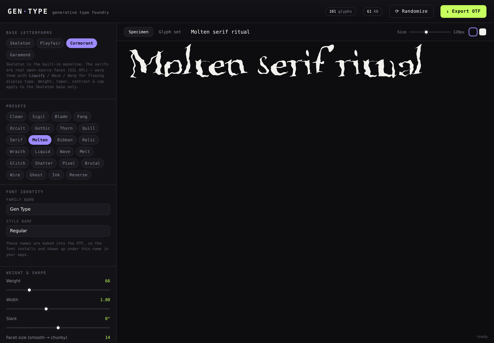

# Gen·Type — generative type foundry

Design **experimental typefaces in the browser** and export **real, installable
OTF font files**. Every glyph is generated procedurally from a monoline
skeleton and a stack of parametric distortions, so you can dial in a look —
liquid, glitched, pixelated, brutal, wavy — and download a font you can install
and use anywhere.

Inspired by the parametric font tools rounded up on
[Slanted](https://www.slanted.de/news/digital-tools/) and the wild display
faces of studios like [h-4.digital](https://h-4.digital/product-category/fonts/).



## What it does

- **Full character set** — A–Z, a–z, 0–9 and a wide range of punctuation &
  symbols (101 glyphs), so the fonts are actually usable for real text.
- **Two kinds of base letterforms:**
  - a built-in **monoline skeleton** (drawn in code) that you ink to any weight,
    with taper / contrast / caps; and
  - **real open-source serifs** — Playfair Display, Cormorant Garamond, EB
    Garamond, **Bodoni Moda** (super-high-contrast Didone) and **Cormorant
    Italic** (calligraphic) — whose actual outlines are warped. **Liquifying a
    high-contrast or italic serif** gives the thin, flowing, abstract
    calligraphic display look of studios like
    [h-4.digital](https://h-4.digital/product-category/fonts/); and
  - **your own font** — click **Load your own font** (or drag a `.ttf`/`.otf`
    onto the page) to use any face you have as the base, then bend it with the
    same Liquify / Wave / Warp controls. Nothing is uploaded — it's read and
    warped entirely in your browser.
- **Live preview = the exported file.** The on-screen specimen is rendered with
  the exact `@font-face` you download — no surprises after installing.
- **Parametric & experimental controls:** weight, width, slant, a **broad-nib
  pen** model (sharp angled terminals, automatic thick/thin, razor corners — the
  sleek/sigil/futuristic look), adjustable **corner sharpness**,
  **stroke taper** (blade / sigil tips, with spike↔blade profile and a
  start↔end bias for calligraphic entry/exit strokes), stroke **contrast**
  (including reverse contrast), facet/smoothness, sine **waves**, flowing
  **noise warp**, **jitter/roughen**, **pixelate**, per-glyph **rotation**,
  and **echo/ghost** repeats — all seeded for reproducibility.
- **33 presets** — sharp broad-nib looks (Sigil, Blade, Kimera, Aether, Aon,
  Talon, Fang, Occult, Gothic, Thorn, Quill), serif-warp & abstract-calligraphic
  looks (Serif, Molten, Ribbon, Relic, Wraith, Hairline, Grimoire, Agonia,
  Seraph, Vellum) and distortion looks (Liquid, Wave, Melt, Glitch, Shatter,
  Pixel, Brutal, Wire, Ghost, Ink, Reverse) — plus **Randomize**.
- **Custom naming** — the family & style names you type are baked into the OTF
  name table, so the font installs and appears under that name in your apps.
- **One-click OTF export**, generated entirely in the browser (no server, no
  upload).

## Run it

Requires **Node.js 18+** ([nodejs.org](https://nodejs.org)). From the repo folder:

```bash
npm install
npm run dev        # start the dev server, then open the URL it prints
```

`npm run dev` prints something like `Local: http://localhost:5173/` — open that
in your browser. That's the way to develop/test it.

Other scripts:

```bash
npm run build      # production build → dist/ (a fully static, bundled site)
npm run preview    # serve the production build locally
npm run test:font  # headless sanity check: build every preset and re-parse the OTF
```

> **⚠️ A plain static server (e.g. `python -m http.server`) on the repo root will
> show an *unstyled, non-working* page.** The source uses ES-module imports, a Web
> Worker, and bundled font assets that must be processed by Vite first — a plain
> file server just serves the raw source. Use `npm run dev`, **or** build first and
> serve the output: `npm run build` then `python -m http.server 8000 -d dist`
> (the `dist/` folder *is* a plain static site and works with any server/host —
> GitHub Pages, Netlify, Vercel…).

## Installing an exported font

1. Click **Export OTF** and save the `.otf`.
2. Install it:
   - **macOS** — double-click the file → *Install Font* (Font Book).
   - **Windows** — right-click → *Install* (or *Install for all users*).
   - **Linux** — copy to `~/.local/share/fonts/` and run `fc-cache -f`.
3. The font shows up under the **Family name** you set before exporting.

> Fonts are generated on your machine and are yours to use. Give each variation
> a distinct family name if you want to install several at once.

## How it works

```
src/engine/
  geometry.js   arcs, ellipses, béziers, arc-length resampling, winding helpers
  glyphs.js     every skeleton glyph as monoline centrelines (+ dot fills)
  stroke.js     centreline → filled outline (per-vertex width: taper, contrast,
                mitred joins, caps, hollow rings)
  serif.js      pull real outlines from a bundled OFL serif (the other base)
  effects.js    glyph-local distortions (liquify / wave / noise / jitter / …)
  presets.js    control schema + named looks
  buildFont.js  params → real opentype.js Font (preview and export)
src/
  worker.js     builds the font off the main thread (smooth dragging)
  main.js       app wiring, live FontFace hot-swap, export
  ui/controls.js  builds the control panel from the schema
```

**The core trick:** each glyph is drawn as thin *centrelines*, then "inked" by
offsetting them to the chosen weight. Overlapping pieces share one winding
direction, so under the nonzero fill rule they simply union into solid letters —
no boolean geometry — while ring letters (O, o, 0, 8…) get a reversed inner
contour so their counters stay open. Because every distortion is a function of
the glyph alone (never its position in a word), a static OTF can reproduce the
preview exactly.

Font files are written with [opentype.js](https://github.com/opentypejs/opentype.js).

## Browser support

Any modern browser (Chrome, Edge, Firefox, Safari). Uses ES modules, Web
Workers, the CSS Font Loading API, and Blob downloads.

## Fonts & licensing

The **Skeleton** base is drawn from scratch in this repo — fonts you export from
it are entirely your own.

The serif bases are bundled (subset to Latin) under the **SIL Open Font License
1.1** — see the `.OFL.txt` files in `src/fonts/`:

- **Playfair Display** — © 2017 The Playfair Display Project Authors
- **Cormorant Garamond** (roman & italic) — © 2015 The Cormorant Project Authors
- **EB Garamond** — © 2017 The EB Garamond Project Authors
- **Bodoni Moda** — © 2020 The Bodoni Moda Project Authors

A font you export from a serif base is a *derivative* of that OFL font, so it
inherits the OFL (free to use, embed, modify and share — just don't ship it
under the original reserved names like "Playfair Display"). Pick your own family
name before exporting, which the tool bakes into the file.

Application code: MIT.
